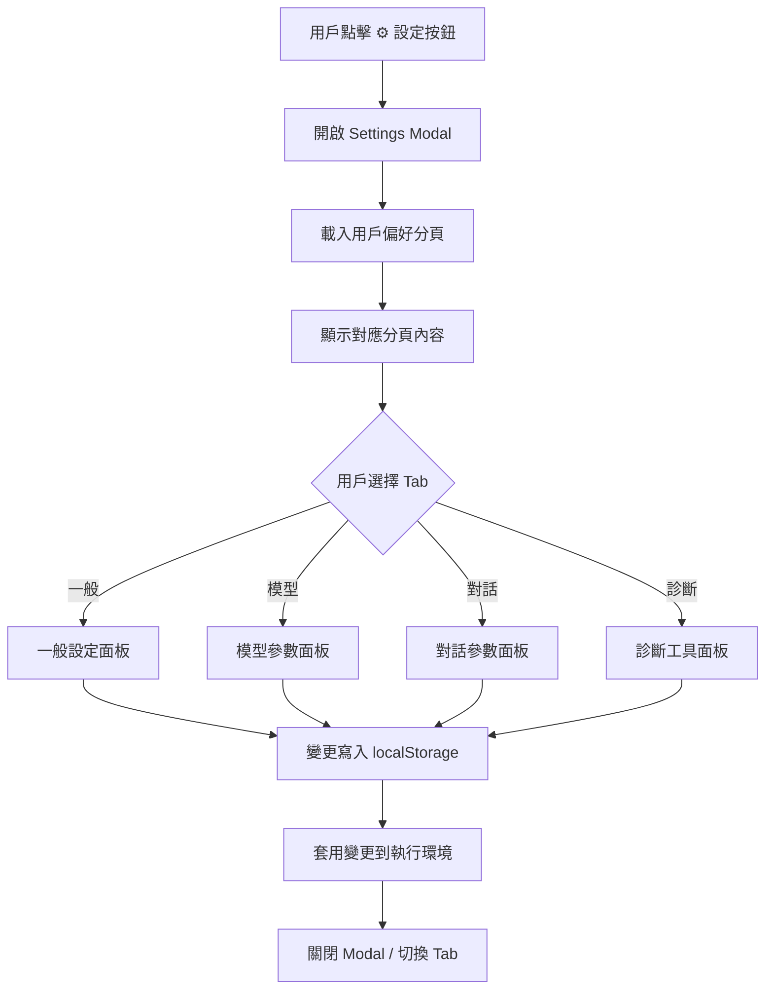

# 全域設定面板 — 開發者模式 (Dev Mode) 實作計劃

## 目標
將現有的單頁設定面板重構為**分頁式開 發者模式**，包含可配置的各類參數，適合一般用戶和開發者使用。

---

## 現狀分析

### 現有設定面板架構
- **位置**: `backend/static/embed/widget.html` (行 388-447)
- **UI 結構**: 單一長滾動面板，4 個 section 無分頁
- **CSS**: `.settings-section`, `.settings-field`, `.settings-row` (行 196-227)

### 現有分區
| Section | 內容 |
|---------|------|
| `llm` | DeepSeek API Key + Endpoint |
| `tts` | TTS 模式、語音選擇、語速、靜音 |
| `voice-input` | 麥克風按鈕 |
| `emote` | 衣裝切換、表情選擇 |

---

## 目標架構

### 分頁導航 (Tab Bar)
```
┌──────────────────────────────────────┐
│  ⚙️ 設定                    [×]      │
├──────────────────────────────────────┤
│  [一般] [模型] [對話] [診斷]           │  ← 新增 tab bar
├──────────────────────────────────────┤
│                                      │
│  (分頁內容區域)                       │
│                                      │
└──────────────────────────────────────┘
```

### 分頁內容規劃

#### 1. 一般 (General) — 原有設定整合
- DeepSeek API Key
- DeepSeek API Endpoint
- MiniMax API Key + Group ID
- TTS 模式 (browser / neural)
- 預設語音
- 語速
- 靜音開關

#### 2. 模型 (Model) — Live2D 動畫參數
- 呼吸幅度 (Breath Amplitude) — range slider
- 身體晃動幅度 (Body Sway Amplitude) — range slider
- 說話時晃動幅度 (Speaking Sway) — range slider
- 眼球追蹤靈敏度 (Eye Tracking Sensitivity) — range slider
- 點擊反應 (Click Reaction Motion) — toggle: Scene1 / Idle
- 閒置動畫間隔 (Idle Animation Interval) — range slider (秒)

#### 3. 對話 (Chat) — AI 回應控制
- 情緒標籤前綴 (Emotion Tag Prefix) — 開/關
- 回應最大長度 (Max Tokens) — range slider: 50-300
- 溫度 (Temperature) — range slider: 0.3-1.2
- 說話文字上限 (TTS Text Cap) — range slider: 80-200
- 關鍵詞表情觸發 (Keyword Emotion Triggers) — 開/關

#### 4. 診斷 (Debug) — 開發者工具
- Debug HUD 顯示 — toggle
- 參數 introspection — button (觸發 `?introspect=full`)
- 日誌等級 (Log Level) — select: verbose / info / warn / error
- Boot diagnostics — button (查看 boot 記錄)
- 清除所有 localStorage — button (確認對話)
- 導出設定 — button (JSON 格式下載)
- 導入設定 — file input (JSON 格式導入)

---

## 附加需求：麥克風按鍵隔離

### 需求說明
用戶反映：麥克風按鍵（`#btn-mic`）目前在 settings modal 內，會遮擋 bubble 對話框。需要將麥克風按鍵**獨立放在 settings modal 外面**，避免遮擋。

### 解決方案
1. **麥克風按鍵移至 `#corner-actions`** — 與 ⚙️ 設定、✕ 關閉按鈕並列
2. **Settings Modal 內只保留語音設定** — 語言選擇、語音輸入相關設定
3. **Mic 按鍵狀態同步** — 按鍵狀態（聆聽中/閒置）需與 modal 內的設定同步

### UI 佈局
```
底部工具列:
[ 🎤 麥克風 ] [ ⚙️ 設定 ] [ ✕ 關閉 ]
              ↑
         獨立按鍵，不遮擋
```

### 實作要點
- `#btn-mic` 從 settings modal 內移除
- 新增 `#corner-actions` 的麥克風按鍵 (或移動現有的)
- Settings modal 內語音輸入 section 調整為純設定（不含按鍵）
- 聆聽中狀態 (`listening`) 同步至按鍵 UI

---

## 實作步驟

### Step 1: 新增 Tab Bar UI 結構
- 在 `.settings-header` 下方新增 `.settings-tabs` 容器
- 4 個 tab 按鈕: 一般、模型、對話、診斷
- CSS: active tab 視覺區分 (底色/邊框)

### Step 2: 重構現有 Settings Modal HTML
- 將現有 4 個 section 包入對應的分頁 container
- 每個分頁 container 預設 `display: none`，active tab 時 `display: block`
- 新增各分頁的專屬設定欄位

### Step 3: 實現 Tab 切換邏輯
- JS: 點擊 tab 按鈕切換可見的分頁 container
- 記住用戶最後瀏覽的分頁 (localStorage)
- 支援鍵盤導航 (← → 鍵切換分頁)

### Step 4: 新增模型參數控制項
- 在 `widget.html` 中新增對應的 HTML 結構
- 實作 `applyModelParams()` 函數寫入 Live2D 參數
- 參數寫入 `localStorage` 持久化

### Step 5: 新增對話參數控制項
- 在 `handleDeepSeekStream()` 中讀取使用者設定
- TTS 字數限制取自設定值

### Step 6: 新增診斷工具
- Debug HUD toggle (控制 `#debug-hud` 顯示)
- `?introspect=full` 觸發
- localStorage 清除功能
- JSON 導出/導入 (使用 Blob + URL.createObjectURL)

### Step 7: 樣式整合
- 將所有新 UI 融入現有 `.settings-*` CSS 系統
- Tab bar 樣式: `.settings-tabs`, `.settings-tab`
- Range slider 統一樣式
- 確認所有斷點響應式

---

## 參數對照表

| 參數名 | JS 變數 | 預設值 | 範圍 |
|--------|---------|--------|------|
| 呼吸幅度 | `__dev_breath_amp` | 0.5 | 0-1 |
| 身體晃動 | `__dev_body_sway` | 2.5 | 0-5 |
| 說話晃動 | `__dev_speaking_sway` | 3.5 | 0-6 |
| 眼球追蹤 | `__dev_eye_track` | 1.0 | 0.5-2.0 |
| Idle 間隔 | `__dev_idle_interval` | 30 | 10-120 |
| Max Tokens | `__dev_max_tokens` | 200 | 50-300 |
| Temperature | `__dev_temperature` | 0.7 | 0.3-1.2 |
| TTS Text Cap | `__dev_tts_cap` | 120 | 80-200 |
| Debug HUD | `__dev_debug_hud` | false | boolean |
| Log Level | `__dev_log_level` | 'info' | verbose/info/warn/error |

---

## Mermaid 流程圖



---

## 預期產出

1. **`backend/static/embed/widget.html`** — 重構後的設定面板
2. **`backend/static/embed/embed.js`** — (如需調整)
3. **`plans/dev-mode-settings-plan.md`** — 本計劃文件

---

## 風險與對策

| 風險 | 對策 |
|------|------|
| 分頁架構破壞現有功能 | 分階段實作，每階段測試 |
| 新參數影響動畫穩定性 | 所有參數有合理預設值和 clamp |
| localStorage 格式變更 | 遷移舊資料或清除提示用戶 |